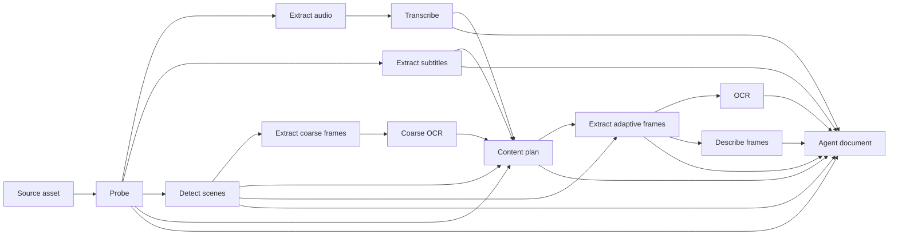

# Media Engine v2 architecture

## Deployment model

The system is designed as a control plane plus independently deployable workers while remaining easy to run with Docker Compose.

Control-plane services:

- `api`: public client API, built-in management dashboard, and authenticated internal worker API;
- `postgres`: durable assets, requests, pipeline runs, stages, artifacts, and workers;
- `scheduler`: expired lease recovery, retention, and object deletion;
- `webhook-dispatcher`: leased, signed delivery of durable terminal-job events;
- `minio`: bundled S3-compatible storage for the default deployment;
- `minio-init`: idempotent bucket initialization.

Worker services:

- `worker-cpu`: portable FFmpeg baseline;
- `worker-rk1`: Rockchip RKMPP acceleration;
- `worker-nvidia`: planned NVENC, NVDEC, and GPU analysis support.

The default Compose deployment includes `worker-cpu`, which executes transcode, media preparation, OCR, and optionally
OpenAI- or xAI-backed stages through leases. The API container still includes FFmpeg only for the temporary legacy
`/jobs` surface and startup test; it is not used to execute `/v2/jobs`. That in-process path is scheduled for removal
after the controlled whY-Tee-WebDL migration.

The dashboard is a static, same-origin application served by the API at `/admin`. It has no separate JavaScript runtime
or frontend service and keeps no administrator password in browser storage. A successful login creates a short-lived,
HTTP-only, SameSite-strict cookie signed with a deployment secret; changing that secret or the bootstrap password
invalidates existing sessions. Cookie-authenticated state changes require an additional dashboard request header, and
the API sends a restrictive Content Security Policy and no-store response headers for all management surfaces. Direct
automation may continue to use HTTP Basic authentication against `/v2/admin`.

## Pre-stable design freedom

Media Engine currently has no external production consumers, so v2 development optimizes for a clean long-term public design rather than legacy compatibility. Breaking changes are allowed until v2 is explicitly declared stable. Existing production deployments should tag their last known-working release and migrate deliberately. See [development-policy.md](development-policy.md) for the compatibility threshold and current-version rules.

## Durable data and media

PostgreSQL is the source of truth for state. S3-compatible object storage is the only durable media and artifact store. Worker-local files are temporary scratch data and must be removed after a stage finishes or fails.

Workers do not require direct PostgreSQL access. Each administrator-created worker has an individually revocable hashed
credential, and the token determines its identity on every internal request. Workers register capabilities and claim
time-limited leases through authenticated internal API endpoints. Inputs and outputs use short-lived signed S3 URLs, so
nodes do not receive permanent object-store credentials. Presigned URLs are treated as credentials: the worker
suppresses HTTP client request logging and replaces transfer exceptions with URL-free errors before they reach
application logs.

Worker retirement is two-step. Revocation immediately disables the credential; removal then hides the node from fleet
state and erases its credential material. The worker row remains as a tombstone so historical stage and job attribution
does not disappear.

A lease token identifies one worker attempt. Heartbeats extend the lease while reporting progress. Maintenance requeues an expired lease until its attempt limit is reached, after which the stage, pipeline run, and attached active requests become failed.

## Core records

- `blob`: exact stored bytes, identified by SHA-256;
- `asset`: client-visible media record referencing a blob and source metadata;
- `job_request`: a client-specific request with idempotency and correlation identifiers;
- `pipeline_run`: one reusable execution, uniquely identified by its deterministic run key;
- `stage_run`: a leased unit of work within a pipeline;
- `stage_dependency`: a durable edge between two stage runs;
- `artifact`: a versioned output referencing a stored blob;
- `worker`: administrator-owned identity and lifecycle, hashed credential metadata, reported capabilities/runtime, and
  heartbeat state;
- `client`: product or integration ownership boundary;
- `api_key`: hashed, scoped, expiring or revocable client credential;
- `provider_config`: encrypted AI vendor connection, models, runtime options, and default state;
- `ai_usage_event`: provider usage, cost, latency, outcome, and exact stage attempt.
- `webhook_endpoint`: client-owned destination, encrypted signing secret, subscriptions, and default state;
- `webhook_event`: immutable per-request terminal notification in the PostgreSQL outbox;
- `webhook_delivery_attempt`: response, timing, error, and outcome for one delivery attempt.

Multiple job requests may attach to one pipeline run. This ensures simultaneous duplicate requests perform expensive work once while preserving client-specific status. Each request independently resolves an optional webhook endpoint. Terminal status and its immutable event are written in one PostgreSQL transaction, including immediate cache hits and final expired-lease failures. A separate dispatcher leases events, signs the exact JSON bytes with the endpoint secret, records every attempt, and retries transient failures. Network delivery never controls job success, and clients can always poll status or retrieve the manifest.

Webhook destinations require HTTPS and must resolve only to public addresses by default. Redirects are disabled and the
destination is resolved again immediately before delivery. Private and plain-HTTP targets can be enabled explicitly for
isolated local testing. Endpoint secrets use the same control-plane encryption key as provider credentials but remain
separate per endpoint and are never sent to workers.

Reusable pipeline runs reference the exact source blob, not the first client asset. Each job request separately references its asset, preserving source provenance while allowing duplicate uploads from different products to share work.

## Stage graphs and artifacts

Pipeline definitions are server-owned and versioned. Submitting a job persists every stage plus dependency edge before work starts. Root stages are queued; dependent stages remain blocked until all their upstream stages complete. Retried stages preserve successful upstream outputs. A pipeline run completes only when every stage completes, and each stage completion is rejected unless all required declared artifacts are reported.

Artifacts record both their reusable pipeline run and exact producer stage. A worker receives the immutable source plus
artifacts produced by its direct dependencies through signed downloads, verifies every SHA-256 and size, requests a
signed upload for each declared output, and publishes it to a content-addressed S3 key. Completion independently checks
the stored size and SHA-256 metadata. The job manifest exposes this provenance without giving clients or workers database
or S3 administrator access.

The latest understanding flow uses a coarse local pass followed by model-planned targeted sampling:

## Capability routing

Workers report capabilities rather than platform names alone. Routing considers decoder, encoder, maximum resolution, hardware backend, filters, pipeline stages, and configured fallback policy.

Source codecs are learned from the media itself rather than trusted client metadata. When a strict hardware worker
probes an unsupported source codec, it returns that lease without consuming an attempt. The control plane persists the
normalized decoder requirement on the stage, so subsequent claims are limited to compatible workers. A deployment with
no compatible decoder leaves the stage safely queued with an actionable dashboard reason instead of repeatedly running
the same failing hardware path.

Hardware- and vendor-specific implementations live behind focused interfaces such as `TranscodeBackend`,
`TranscriptionProvider`, `ContentPlanningProvider`, `VisionProvider`, `SummaryProvider`, `OcrProvider`, and future
`EmbeddingProvider` implementations. The control plane stores vendor credentials with authenticated encryption and
decrypts one only when an authenticated worker claims a matching provider stage. Workers advertise adapter support, do
not keep vendor keys in their environment, and close the per-stage provider client after the attempt. Understand-v2
stages select their provider independently, and provider/model identity is part of the run key so comparison runs cannot
collide in the cache.

The worker control API should stay on a trusted private network. Deployments spanning hosts must use TLS and restrict the
worker route because a provider-backed claim necessarily carries plaintext credentials to the process executing that
stage. Individual token rotation/revocation limits one compromised node without disrupting the rest of the fleet; mutual
TLS can be added for deployments that require a stronger machine-identity layer.

## Deployment shapes

The default Compose project runs the control plane, MinIO, and a CPU-capable Media Engine container on one host. The
`compose.control-plane.yaml` overlay suppresses that local worker when processing is fully remote. RK1 and future
accelerator definitions can be local overlays or independent worker deployments.

Docker Compose separates services on one Docker host. A multi-host installation runs the control-plane Compose project on
one host and a one-service Compose project on each worker node. Remote workers need outbound access to only the
authenticated worker API and worker-facing S3 endpoint; they do not expose ports or receive PostgreSQL, administrator,
encryption, webhook, object-store, or long-lived provider credentials. See
[worker-deployment.md](worker-deployment.md).
