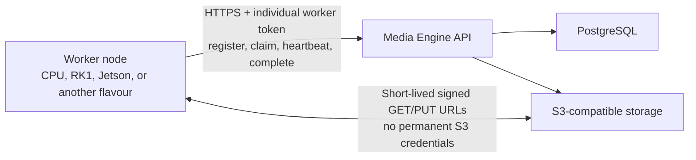

# Standalone worker deployment

Media Engine workers can run on separate hosts from the control plane. Each worker polls for compatible stage leases,
downloads inputs through short-lived signed URLs, processes them locally, uploads outputs through short-lived signed
URLs, and reports completion through the worker API.



A standalone worker needs only:

- Docker Engine with the Compose plugin;
- outbound access to the worker API;
- outbound access to the worker-facing S3/MinIO endpoint;
- one individually revocable worker token.

It receives no PostgreSQL URL, administrator credential, control-plane encryption key, webhook secret, or permanent S3
credential. Provider-backed claims can contain the selected provider credential for that attempt, so the worker host is a
trusted execution node and the worker API must use HTTPS or a trusted private network.

## Deployment choices

| Deployment | Compose command | Use when |
| --- | --- | --- |
| All in one | `docker compose --env-file .env.local up -d --build` | One host runs the control plane and CPU worker |
| Control plane only | `docker compose --env-file .env.local -f compose.yaml -f compose.control-plane.yaml up -d --build` | All workers run elsewhere |
| Standalone CPU | `docker compose --env-file .env.worker -f compose.worker.yaml up -d` | Generic AMD64 or ARM64 host |
| Standalone RK1 | `docker compose --env-file .env.worker -f compose.worker-rk1.yaml up -d` | RK3588 with RKMPP devices |
| Standalone Xavier NX | `docker compose --env-file .env.worker -f compose.worker-jetson-xavier-nx.yaml up -d` | Xavier NX 16GB on JetPack 5/L4T R35 |
| All-in-one RK1 | `docker compose --env-file .env.local -f compose.yaml -f compose.local-rk1.yaml up -d --build` | Control plane and RK1 share one host |
| Portainer RK1 | Deploy `compose.portainer-rk1.yaml` as a Docker Standalone stack | Portainer pulls published images |

The all-in-one definitions import `MEDIA_ENGINE_LOCAL_WORKER_TOKEN` as the credential for their one bundled worker.
Every separately deployed worker is created through the dashboard or management API and receives a different token.
PostgreSQL remains authoritative after that initial enrolment: restarting the API does not undo a drain or revocation.
If the bundled token is rotated in the dashboard, replace `MEDIA_ENGINE_LOCAL_WORKER_TOKEN` in the all-in-one environment
before restarting; a stale value fails startup with an actionable error instead of restoring an old credential.

## Prepare the control plane

Before adding remote workers, configure two reachable addresses:

```dotenv
# Use the normal Media Engine HTTPS origin unless you intentionally deploy a separate worker-only route.
MEDIA_ENGINE_WORKER_ADVERTISED_API_URL=https://media.example.com

# S3/MinIO address reachable from worker hosts. Signed URLs use this exact hostname.
MEDIA_ENGINE_S3_WORKER_ENDPOINT_URL=https://s3.media.example.com
```

`MEDIA_ENGINE_S3_ENDPOINT_URL` remains the control plane's internal S3 address. `MEDIA_ENGINE_S3_PUBLIC_ENDPOINT_URL`
is used for client artifact downloads. `MEDIA_ENGINE_S3_WORKER_ENDPOINT_URL` is specifically for worker stage transfers.
They may all be the same URL, but separate values keep Docker-internal, client-facing, and worker-facing routing correct.

The recommended NGINX example proxies `/v2/internal/*` on the normal API hostname. Requests still require the generated
worker token, and workers expose no inbound ports. This gives LAN and internet-connected workers one deployment contract.
Normal hairpin NAT or routed IPv6 is sufficient for workers on the same network. When Docker lacks IPv6 and IPv4 NAT
reflection is unavailable, add local DNS records for the API and S3 hostnames that point at the reverse proxy's LAN IP.
If an installation requires network-level isolation, adapt `deploy/nginx/media-engine-worker.conf.example` as an
advanced worker-only hostname and allow only trusted worker or VPN addresses.

Choose the transcode routing policy on the control plane:

- `MEDIA_ENGINE_TRANSCODE_REQUIRED_BACKEND=cpu` requires a CPU worker;
- `MEDIA_ENGINE_TRANSCODE_REQUIRED_BACKEND=rkmpp` requires an RKMPP worker;
- `MEDIA_ENGINE_TRANSCODE_REQUIRED_BACKEND=nvv4l2` requires a Jetson multimedia worker;
- an empty value allows any worker satisfying the rest of the stage contract.

The RK1 all-in-one and Portainer examples default this setting to `rkmpp` because that is their bundled accelerator.
When attaching Jetson and RK1 workers to the same control plane, define the variable with an explicitly empty value so
new stages can be claimed by either compatible backend. Capability and output-contract checks still apply.

## Create a worker identity

1. Sign in to `/admin`.
2. Open **Workers** and select **Add worker**.
3. Enter a descriptive name and a packaging profile such as `cpu`, `rk1`, `jetson-xavier-nx`, `intel-qsv`, or
   `amd-vaapi`.
4. Optionally set an expiry for temporary capacity.
5. Save the generated environment block immediately. The `mew_...` token is returned only once; PostgreSQL stores only
   its hash.

The token determines the worker identity. A container cannot choose another worker ID, rename itself, or impersonate a
different node. Display names and lifecycle state remain administrator-owned.

## Deploy a CPU worker

On a generic AMD64 or ARM64 worker host:

```bash
cp .env.worker.example .env.worker
chmod 600 .env.worker
```

Replace the example URL and token with the values generated by the dashboard. Pin an immutable release image:

```dotenv
MEDIA_ENGINE_WORKER_API_URL=https://media.example.com
MEDIA_ENGINE_WORKER_TOKEN=mew_replace_with_the_one_time_token
MEDIA_ENGINE_WORKER_IMAGE=jimstro/media-engine:0.4.1
MEDIA_ENGINE_WORKER_HOSTNAME=worker-node-01
```

Validate and start the one-container stack:

```bash
docker compose --env-file .env.worker -f compose.worker.yaml config
docker compose --env-file .env.worker -f compose.worker.yaml pull
docker compose --env-file .env.worker -f compose.worker.yaml up -d
docker compose --env-file .env.worker -f compose.worker.yaml logs -f worker
```

The CPU definition opens no ports, drops Linux capabilities, enables `no-new-privileges`, and uses a named volume only
for scratch data. Durable media remains in S3.

## Deploy an RK1 worker

Use the same generated `.env.worker`, but select the RK1 image and Compose file:

```dotenv
MEDIA_ENGINE_WORKER_IMAGE=jimstro/media-engine:rk1-0.4.1
MEDIA_ENGINE_WORKER_HOSTNAME=rknode-2
```

```bash
docker compose --env-file .env.worker -f compose.worker-rk1.yaml config
docker compose --env-file .env.worker -f compose.worker-rk1.yaml pull
docker compose --env-file .env.worker -f compose.worker-rk1.yaml up -d
docker compose --env-file .env.worker -f compose.worker-rk1.yaml logs -f worker
```

The RK1 definition exposes the RK3588 DRM, MPP, RGA, and DMA-heap devices and fails its startup self-test when RKMPP is
unavailable. Confirm these host paths exist before deployment:

```text
/dev/dri
/dev/mpp_service
/dev/rga
/dev/dma_heap
```

The image uses Ubuntu 24.04 because the Rockchip multimedia packages are not published for Ubuntu 26.04. This exception
is isolated to the worker image; the worker protocol and control plane remain hardware-neutral.

## Deploy a Jetson Xavier NX 16GB worker

This profile targets Xavier NX on JetPack 5/L4T R35. The worker image deliberately uses NVIDIA's matching
`l4t-tensorrt:r8.5.2-runtime` base: CUDA and TensorRT user-space versions must remain compatible with the host BSP. Do
not replace it with a generic ARM64 CUDA image or a JetPack 6/L4T R36 image. NVIDIA documents the Xavier NX multimedia
limits and codecs in its [Jetson Linux feature table](https://docs.nvidia.com/jetson/archives/r35.6.0/DeveloperGuide/SO/JetsonXavierNxSeries.html)
and the native GStreamer elements in the [accelerated GStreamer guide](https://docs.nvidia.com/jetson/archives/r35.6.1/DeveloperGuide/SD/Multimedia/AcceleratedGstreamer.html).

Before deployment, confirm Docker reports the NVIDIA runtime and the host reports L4T R35:

```bash
docker info --format '{{.DefaultRuntime}}'
head -n 1 /etc/nv_tegra_release
```

The first command should report `nvidia`; the second should start with `# R35`. Create the worker with profile
`jetson-xavier-nx`, then use its generated token in:

```dotenv
MEDIA_ENGINE_WORKER_IMAGE=jimstro/media-engine:jetson-xavier-nx-0.4.1
MEDIA_ENGINE_WORKER_HOSTNAME=nvnode-1
```

```bash
docker compose --env-file .env.worker -f compose.worker-jetson-xavier-nx.yaml config
docker compose --env-file .env.worker -f compose.worker-jetson-xavier-nx.yaml pull
docker compose --env-file .env.worker -f compose.worker-jetson-xavier-nx.yaml up -d
docker compose --env-file .env.worker -f compose.worker-jetson-xavier-nx.yaml logs -f worker
```

The Compose file uses the NVIDIA container runtime and opens no inbound port. At boot the worker requires
`nvv4l2decoder`, both H.264/H.265 encoders, VIC conversion/compositing, the matching parser/muxer plugins, and the
NVDEC/NVENC/VIC device nodes. It then performs a real H.264 hardware encode/decode round trip before authenticating.
CPU video fallback is disabled, so a broken accelerator never masquerades as a healthy Jetson worker.
Two read-only single-file mounts expose the host's model and L4T release text to the dashboard; they grant no broader
host filesystem access.

Once online, the node reports its detected capabilities. A fully configured Xavier NX image normally shows:

- H.264/H.265 NVENC;
- H.264/H.265, JPEG, VP8/VP9, MPEG-2/MPEG-4 NVDEC;
- VIC scale, colorspace conversion, and compositing;
- Volta CUDA, TensorRT, dual DLA, and dual PVA hardware when their libraries/devices are present.

The current transcode path uses NVDEC, VIC, and NVENC. CUDA, TensorRT, DLA, and PVA are advertised as detected capacity
for future worker flavours and pipelines; claiming their presence does not imply that the current transcode stage uses
them.

Xavier NX does not advertise AV1 decoding. When it is the first worker to inspect an AV1 transcode, it fails fast before
GStreamer starts and returns the lease without spending an attempt. The control plane records `decoders: av1` on that
stage, then an AV1-capable RK1 or CPU worker can claim it. If no compatible node is attached, the stage remains queued
and its dashboard detail reports `unsupported_input_codec` instead of repeatedly failing or hanging on Jetson.

Every transcode has two safety bounds: `MEDIA_ENGINE_MEDIA_COMMAND_TIMEOUT_SECONDS` limits total command runtime and
`MEDIA_ENGINE_MEDIA_NO_PROGRESS_TIMEOUT_SECONDS` stops a pipeline that has stopped producing frames or FFmpeg progress.
The defaults are 1800 and 120 seconds. Increase the hard limit for unusually slow or long media; increase the
no-progress limit only when a valid codec has unusually expensive startup.

## Portainer worker-only stack

1. Create the worker in the Media Engine dashboard and keep the generated token open.
2. In Portainer, select **Stacks → Add stack**.
3. Paste `compose.worker.yaml` for a CPU node, `compose.worker-rk1.yaml` for an RK1, or
   `compose.worker-jetson-xavier-nx.yaml` for a Xavier NX.
4. Add the generated values as stack environment variables.
5. Deploy the stack and inspect the `worker` container logs.
6. Return to Media Engine and confirm the node becomes online.

Use a Portainer secret or restricted environment variable for `MEDIA_ENGINE_WORKER_TOKEN` when the installation supports
it. The worker also supports `MEDIA_ENGINE_WORKER_TOKEN_FILE`; a custom Compose override can mount a secret read-only and
point this setting at `/run/secrets/media_engine_worker_token`.

## Verify attachment

A ready node logs `Worker authenticated and registered`. In **Dashboard → Workers**, confirm:

- the expected name is online;
- hostname, architecture, worker version, profile, backend, processors, decoders, encoders, and providers are visible;
- the token's last-used timestamp changes;
- a compatible job shows an active lease on that worker;
- output artifacts become available after the signed upload completes.

Registration does not make the container authoritative about its identity. The API derives identity from the token and
only accepts capabilities and runtime facts from the authenticated node.

## Drain, resume, rotate, revoke, and remove

- **Drain** prevents new claims. An existing lease may heartbeat and finish normally.
- **Resume** allows claims again after draining.
- **Rotate token** invalidates the old token immediately and displays a replacement once. Update `.env.worker` and
  recreate the container. For an all-in-one bundled worker, update `MEDIA_ENGINE_LOCAL_WORKER_TOKEN` because that one
  value is supplied to both the API enrolment and worker service.
- **Revoke** immediately rejects registration, claims, heartbeats, completion, and failure reports. Use this for a lost
  or retired host. Rotating its token creates a fresh credential and reactivates the worker.
- **Remove** appears after revocation. It removes the node from fleet views and erases its credential material while
  retaining a small audit record so completed jobs can still show which worker ran them. A worker with an active lease
  cannot be removed. A bundled all-in-one worker must first be removed from the deployment configuration.

Before planned maintenance, drain the node and wait until its active lease disappears. If a process stops unexpectedly,
the lease expires and the scheduler safely requeues the stage up to its attempt limit.

## Multiple workers

Create one dashboard identity and one `.env.worker` file per running worker process. Do not copy one token across nodes or
use `docker compose up --scale worker=N` with a shared environment file. To run two processes on one host, use distinct
tokens and Compose project names:

```bash
docker compose -p media-worker-01 --env-file .env.worker-01 -f compose.worker.yaml up -d
docker compose -p media-worker-02 --env-file .env.worker-02 -f compose.worker.yaml up -d
```

Each worker currently claims one stage at a time. Adding workers increases parallelism without changing the control
plane, PostgreSQL, or S3 deployment.

## Add another hardware flavour

A flavour is packaging plus capability reporting, not a new API protocol. A Jetson, Intel Quick Sync, or AMD VA-API
worker should reuse `python -m app.worker` and change only:

- its container image and required runtime libraries;
- device, library, and security mounts in its Compose file;
- `MEDIA_ENGINE_WORKER_BACKEND` and `MEDIA_ENGINE_WORKER_PROFILE`;
- its startup self-test and advertised processors, encoders, or accelerators.

Pipeline stages declare required capabilities and the scheduler matches them against the worker's advertised
capabilities. Do not add hardware-name branches to the control plane when a capability can express the requirement.

## Upgrade or replace a worker

For the `0.4.1` codec-routing protocol change, upgrade the control plane first, drain old hardware workers, and then
replace every worker image before resuming them. A `0.4.1` worker needs the new decline endpoint, while an older worker
does not advertise the decoder capabilities needed after a lease is returned.

1. Drain the worker in the dashboard.
2. Wait for its active lease to finish.
3. Change `MEDIA_ENGINE_WORKER_IMAGE` to the new immutable tag.
4. Pull and recreate the service.
5. Resume the worker and run a representative job.

```bash
docker compose --env-file .env.worker -f compose.worker.yaml pull
docker compose --env-file .env.worker -f compose.worker.yaml up -d
```

Use the matching hardware Compose filename for an RK1 or Xavier NX. Replacing the container does not require a new
identity or token. Rotate the token only when its confidentiality is uncertain or an operator intentionally wants a
fresh credential.

## Troubleshooting

| Symptom | Check |
| --- | --- |
| Repeated `401 Unauthorized` | Token is complete, not expired/revoked, and belongs to this worker |
| Registration retries | Worker API URL, TLS trust, NGINX route, firewall, and dashboard desired state |
| Signed download/upload fails | `MEDIA_ENGINE_S3_WORKER_ENDPOINT_URL`, DNS, TLS, S3 path style, and reverse-proxy request preservation |
| Worker is online but claims nothing | Desired state, stage requirements, backend routing policy, and advertised capabilities |
| AI stage remains queued | Selected provider is enabled and the worker advertises the provider adapter |
| RK1 startup self-test fails | Device nodes, library mounts, permissions, and Rockchip FFmpeg build |
| Rotated worker remains unauthorized | Replace the entire token in `.env.worker`, then recreate the container |
| Worker is offline after creation | A created identity stays offline until its first authenticated registration |
