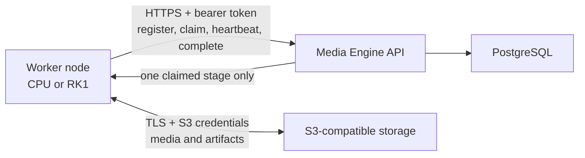

# Standalone worker deployment

Media Engine workers can run on separate hosts from the control plane. A worker polls for compatible stage leases,
downloads source media and upstream artifacts directly from S3, processes them locally, uploads its outputs to S3, and
reports completion through the worker API.



The worker needs no PostgreSQL URL, administrator credentials, control-plane encryption key, webhook secrets, or provider
API keys. When an AI-backed stage is claimed, the control plane sends that stage's provider connection over the trusted
worker API and the worker discards it after the attempt.

## Deployment choices

| Deployment | Compose command | Use when |
| --- | --- | --- |
| All in one | `docker compose --env-file .env.local up -d --build` | One host should run the control plane and CPU worker |
| Control plane only | `docker compose --env-file .env.local -f compose.yaml -f compose.control-plane.yaml up -d --build` | All workers run on other hosts |
| Standalone CPU worker | `docker compose --env-file .env.worker -f compose.worker.yaml up -d` | Generic AMD64 or ARM64 worker |
| Standalone RK1 worker | `docker compose --env-file .env.worker -f compose.worker-rk1.yaml up -d` | RK3588 worker with RKMPP devices |
| All-in-one RK1 | `docker compose --env-file .env.local -f compose.yaml -f compose.local-rk1.yaml up -d --build` | Control plane and RK1 worker share one host |

## Prepare the control plane

1. Give workers a stable HTTPS or private-VPN URL for the Media Engine API. The reverse proxy must pass
   `/v2/internal/*` to the API.
2. Give workers a network-reachable TLS endpoint for the same S3 bucket used by the control plane.
3. Copy the exact `MEDIA_ENGINE_WORKER_API_TOKEN` from the control-plane environment. Treat it as a secret: it authorizes
   worker registration and stage claims.
4. Choose the transcode routing policy in `.env.local`:
   - `MEDIA_ENGINE_TRANSCODE_REQUIRED_BACKEND=cpu` allows only CPU workers to claim new transcodes;
   - `MEDIA_ENGINE_TRANSCODE_REQUIRED_BACKEND=rkmpp` requires an RKMPP worker;
   - `MEDIA_ENGINE_TRANSCODE_REQUIRED_BACKEND=` allows either compatible backend.
5. If the central host should not process work, start it with the `compose.control-plane.yaml` overlay.

The worker API can carry a provider credential for a claimed stage. Never expose it over plain HTTP across an untrusted
network. Prefer a private VPN; otherwise use HTTPS and restrict the route by firewall or reverse-proxy policy. Workers
need outbound connectivity only and expose no ports.

## Deploy a CPU worker

On the worker host:

```bash
cp .env.worker.example .env.worker
chmod 600 .env.worker
```

Fill these values:

- `MEDIA_ENGINE_WORKER_API_URL`: control-plane URL, without a trailing `/v2` path;
- `MEDIA_ENGINE_WORKER_API_TOKEN`: the control-plane worker token;
- `MEDIA_ENGINE_WORKER_KEY`: a stable identifier unique across the entire Media Engine installation;
- `MEDIA_ENGINE_WORKER_DISPLAY_NAME`: the operator-friendly dashboard name;
- the `MEDIA_ENGINE_S3_*` values for the shared bucket.

Validate and start it:

```bash
docker compose --env-file .env.worker -f compose.worker.yaml config
docker compose --env-file .env.worker -f compose.worker.yaml up -d
docker compose --env-file .env.worker -f compose.worker.yaml logs -f worker
```

For a release deployment, pin `MEDIA_ENGINE_WORKER_IMAGE` to an immutable version such as
`jimstro/media-engine:0.2.0`. Leaving it empty uses `jimstro/media-engine:latest`.

## Deploy an RK1 worker

Use the same small environment file, but start the RK1 definition:

```bash
docker compose --env-file .env.worker -f compose.worker-rk1.yaml config
docker compose --env-file .env.worker -f compose.worker-rk1.yaml up -d
docker compose --env-file .env.worker -f compose.worker-rk1.yaml logs -f worker
```

The RK1 file defaults to `jimstro/media-engine:rk1-latest`; pin releases as
`jimstro/media-engine:rk1-0.2.0`. It exposes the RK3588 DRM, MPP, RGA, and DMA-heap devices and deliberately fails its
startup self-test when RKMPP is unavailable. The image uses Ubuntu 24.04 because the Rockchip multimedia packages are not
published for Ubuntu 26.04.

Before starting it, confirm the host provides:

```text
/dev/dri
/dev/mpp_service
/dev/rga
/dev/dma_heap
```

The library mounts in `compose.worker-rk1.yaml` match the Ubuntu paths used on the supported RK1 installation. Adjust them
only when the host packages place those libraries elsewhere.

## S3 permissions

Workers need bucket metadata access plus read/write access to content-addressed objects. They do not delete retained
objects; deletion belongs to the control-plane scheduler. For AWS-style policies, a worker credential can use a policy
like this after replacing the bucket name:

```json
{
  "Version": "2012-10-17",
  "Statement": [
    {
      "Effect": "Allow",
      "Action": [
        "s3:GetBucketLocation",
        "s3:ListBucket",
        "s3:ListBucketMultipartUploads"
      ],
      "Resource": "arn:aws:s3:::media-engine"
    },
    {
      "Effect": "Allow",
      "Action": [
        "s3:GetObject",
        "s3:PutObject",
        "s3:AbortMultipartUpload",
        "s3:ListMultipartUploadParts"
      ],
      "Resource": "arn:aws:s3:::media-engine/blobs/sha256/*"
    }
  ]
}
```

Use `MEDIA_ENGINE_S3_FORCE_PATH_STYLE=true` for MinIO. Use `false` for ordinary AWS virtual-hosted bucket addressing.
When the worker runs with an AWS instance or task role, the access-key fields may remain empty.

## Multiple workers

Run the worker Compose project on every node with its own `.env.worker`. Each `MEDIA_ENGINE_WORKER_KEY` must be unique and
stable across container recreation. Reusing one key makes two processes appear as one worker and can corrupt lease
ownership.

Do not use `docker compose up --scale worker=N` with one environment file because every replica would share the same key.
To run multiple workers on one machine, use separate environment files, unique keys, and unique Compose project names:

```bash
docker compose -p media-worker-01 --env-file .env.worker-01 -f compose.worker.yaml up -d
docker compose -p media-worker-02 --env-file .env.worker-02 -f compose.worker.yaml up -d
```

## Verify attachment

A ready worker logs `Worker registered and S3 access verified`. In the management dashboard:

1. open **Workers**;
2. confirm the expected display name is **online**;
3. inspect its backend, processors, and provider adapters;
4. submit a compatible job and confirm the active lease appears on that worker.

The worker retries while either the API or S3 is unavailable. It does not advertise itself as ready until both connections
work.

## Upgrades and recovery

Before upgrading, check the dashboard for an active lease. Change the pinned image tag, then run:

```bash
docker compose --env-file .env.worker -f compose.worker.yaml pull
docker compose --env-file .env.worker -f compose.worker.yaml up -d
```

Use the RK1 filename for an RK1 node. If a worker stops during a stage, the lease expires and the scheduler safely requeues
the stage up to its attempt limit. The worker's named volume contains scratch data only; durable media remains in S3.

## Troubleshooting

| Symptom | Check |
| --- | --- |
| Repeated `401 Unauthorized` | Worker and control plane must have the exact same `MEDIA_ENGINE_WORKER_API_TOKEN` |
| Repeated readiness failures | API URL, TLS trust, S3 endpoint, bucket name, credentials, and path-style setting |
| Worker is online but never claims transcodes | `MEDIA_ENGINE_TRANSCODE_REQUIRED_BACKEND` and the worker's `cpu`/`rkmpp` backend |
| AI stage remains queued | The selected provider must be enabled and the worker must report that provider adapter |
| RK1 startup self-test fails | Required device nodes, library mounts, and the Rockchip FFmpeg build |
| Worker appears twice after replacement | Reuse the original key for the replacement and stop the old process |

The first worker protocol uses one shared bootstrap token. Rotating it requires updating the control plane and every worker.
Individually revocable worker credentials are planned before the worker trust model is considered stable.
